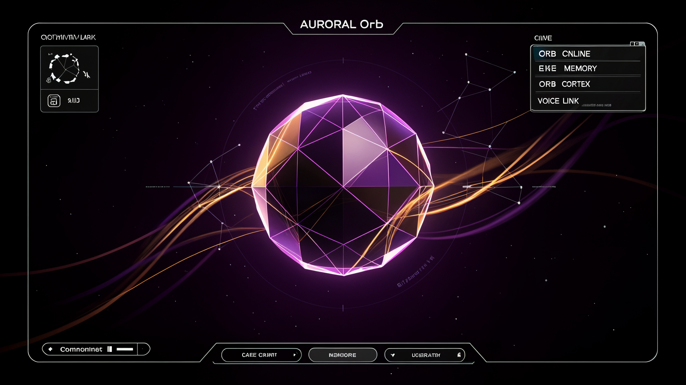

# Orb Interface Concept

The original `IDEA.md` artifact was an image saved with the wrong extension. The concept image is now stored at:

- `IDEA_ORB_v2.png` — improved Orb command-deck concept

The image represents the AURORAL Orb interface: a central geometric intelligence node, visible system status, memory/cortex/voice surfaces, and a persistent command entry point.

## Intended direction

- Event-driven motion, not perpetual ambient animation
- Status visible by default
- Voice and typed interaction as one channel
- Memory and swarm state surfaced in the main deck
- Dark plum, violet, and amber visual language

## Related implementation files

- `the-orb.html`
- `memory-palace.html`
- `.hermes/desktop-attachments/orb_renderer.js`
- `HERMES UPGRADE/orb-voice-presence-design.md`

**Generated concept revision:** 2026-08-15

[UNVERIFIED] The image is a design reference, not proof that every shown UI control exists in the current implementation.
