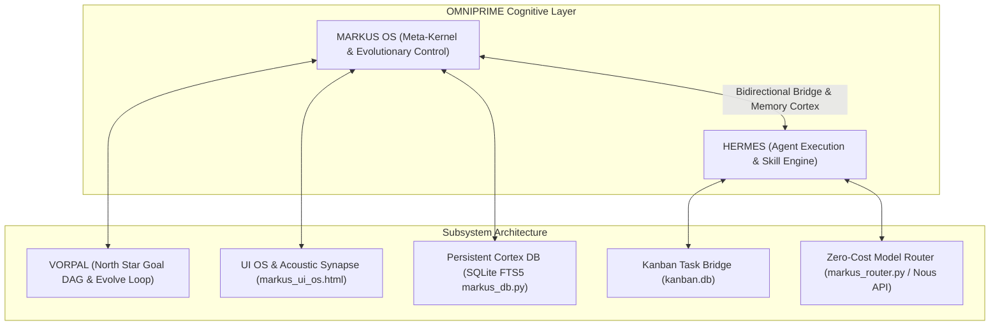
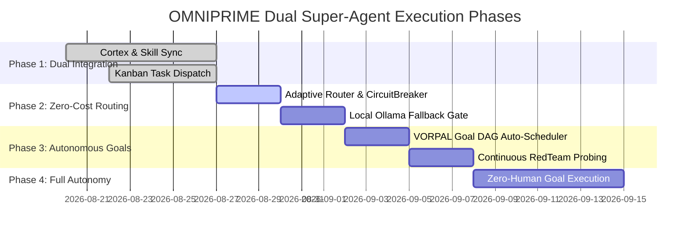

# OMNIPRIME — Dual Super-Agent Autonomous Architecture & Roadmap

**Vision:** A fully autonomous, zero-cost, unbiased, and self-evolving dual super-agent ecosystem operating on a single Windows laptop.

---

## 🏛️ System Topology: The Dual Super-Agent Triad

---

## 🎯 Core Architectural Pillars

### 1. Zero-Cost / Free-Tier AI Model Infrastructure
- **Model Triage & Fallback Stack**:
  - **Fast Execution & Telemetry**: `poolside/laguna-s-2.1:free` ($0.00 / 0ms)
  - **Architecture & High-Context Planning**: `nvidia/nemotron-3-ultra:free` / `deepseek-v4-pro` ($0.00)
  - **Code Generation & Linting**: `inclusionai/ling-3.0-flash` ($0.00)
  - **Offline Local Fallback**: Local Ollama (`qwen2.5-coder`, `llama3.2`) when network is offline.
- **Circuit-Breaker Auto-Switching**: `MarkusAdaptiveWeightMatrix` + `CircuitBreakerManager` automatically suppresses rate-limited endpoints (HTTP 429) and routes to active zero-cost alternatives without human intervention.

### 2. Autonomous & Unbiased Multi-Agent Consensus
- **Tri-Model Consensus Arbiter (`markus_consensus.py`)**:
  - Evaluates candidate code and decisions across 3 independent model perspectives (`PROPOSER`, `FORENSIC_SENTINEL`, `SYNTHESIZER`).
  - Calculates mathematical alignment scores (0.0 to 1.0) and eliminates subjective bias before writing changes to disk.
- **RED/BLUE Adversarial Probing (`markus_redteam.py`)**:
  - Automatically mutates code to find vulnerability edge cases (RED), synthesizes fixes (BLUE), and validates AST syntax cleanly.

### 3. Dual Super-Agent Co-Existence on 1 Windows Laptop
- **Agent 1 — MARKUS OS**: Microkernel daemon, L3 persistent cortex storage, 7-phase co-evolution cycle, 36-action dice engine, UI OS window manager, and THORS defense engine.
- **Agent 2 — HERMES**: Task dispatch engine, kanban worker (`markus_kanban_worker.py`), MCP tool integrations, and skill auto-patcher (`cortex-skill-auto-patcher`).
- **Resource Efficiency for Windows Laptop**:
  - SQLite FTS5 thread-safe connection pooling.
  - Subprocess containment sandboxes with CPU/Memory limits (`markus_sandbox.py`).
  - Stdlib-only verification harnesses (`hermes_verify_evolution_loops.py`).

---

## 🚀 4-Phase Master Milestone Roadmap

### Phase 1: Dual Subsystem Foundation (CURRENT — 100% Verified)
- ✅ `markus_ui_db.py` & `markus_ui_os.html`: Web & Desktop UI OS shell with draggable windows, live SSE ticker, and procedural Web Audio.
- ✅ `hermes_verify_evolution_loops.py`: 7-gate verification harness for Reflexion, Population-Based Dice, and RedTeam loops.
- ✅ `markus_vorpal_bridge.py`: Bidirectional goal DAG and telemetry synchronizer (`OVERALL: PASS`).
- ✅ `markus-evolutionary-loop` (v1.1.0): Hermes skill manifest updated in `~/AppData/Local/hermes/skills/`.

### Phase 2: Zero-Cost Multi-Model Resilience & Local Fallback
- 🔲 **Zero-Cost Router Hardening**: Enforce 100% free-tier routing across Nous API, OpenRouter free models, and local Ollama (`qwen2.5-coder`) for $0 operational cost.
- 🔲 **Self-Healing Failover**: Auto-quarantine rate-limited model tiers with `CircuitBreakerManager` backoff.

### Phase 3: VORPAL Goal DAG Auto-Scheduler & Capability Compounding
- 🔲 **Autonomous Goal Claiming**: VORPAL Goal DAG automatically feeds unfulfilled goals into `markus_kanban_worker.py` and `markus_epoch_scheduler.py`.
- 🔲 **Continuous Capability Synthesis**: `MarkusCapabilitySynthesizer` automatically authors new capability drivers when unknown tool requests are detected.

### Phase 4: Unbiased Zero-Human Autonomous Execution
- 🔲 **Autonomous Dual-Agent Swarm**: MARKUS OS and HERMES continuously execute, verify, reflect, and patch goals 24/7 on local Windows hardware with zero manual prompts required.
