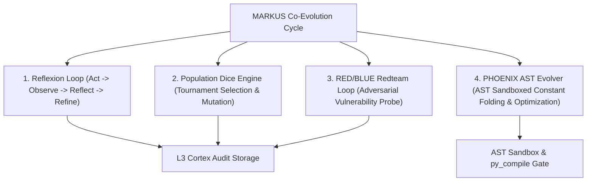

# MARKUS OS Evolutionary Loop Orchestrator (`markus-evolutionary-loop`)

This skill governs the execution, verification, and orchestration of the four core evolutionary feedback loops in MARKUS OS.

---

## When to Use

Use this skill whenever:
- Executing an evolutionary epoch cycle (`markus_co_evolution.py` or `markus_epoch_scheduler.py`).
- Optimizing code performance or AST node tree mutations via `phoenix_evolver.py`.
- Running an adversarial RED/BLUE security and stability probe via `markus_redteam.py`.
- Performing self-reflection over failed step trajectories via `markus_reflexion.py`.
- Selecting optimal prompt/action strategies via `markus_population_dice.py`.

---

## Architecture of the Four Evolutionary Loops



---

## Step-by-Step Execution Protocol

### Step 1: Pre-Flight Verification Gate
Before invoking any loop in production, verify syntax integrity across all evolutionary engines using the stdlib AST compilation gate:

```bash
python -m py_compile markus_reflexion.py markus_population_dice.py markus_redteam.py phoenix_evolver.py markus_co_evolution.py
```

### Step 2: Reflexion Trajectory Pass
For failed execution steps or low-confidence actions, capture the step trajectory and synthesize a self-reflection note:

```python
from markus_reflexion import ReflexionLoopEngine

reflexion = ReflexionLoopEngine()
reflexion.collect_trajectory(
    action="call_tool_api",
    observation="HTTP 503 Service Unavailable",
    success=False,
    latency_ms=450.0
)
reflection_summary = reflexion.generate_self_reflection()
print("Reflexion Reflection:", reflection_summary)
```

### Step 3: Population Tournament Selection
To determine the best operational action, run a tournament selection across the population of dice engines:

```python
from markus_population_dice import PopulationDiceEngine

population = PopulationDiceEngine(num_engines=5)
winner = population.select_tournament_winner(tournament_size=3)
action_payload = winner.roll_action()
print(f"Tournament Winner PID={winner.pid}, Action={action_payload.action_name}")
```

### Step 4: RED/BLUE Adversarial Probing
Run adversarial RED probes against target kernel handlers to identify edge cases before deploying changes:

```python
from markus_redteam import RedTeamEngine

redteam = RedTeamEngine()
vulns = redteam.run_red_phase(target_module="markus_brain_backend")
if vulns:
    patch = redteam.run_blue_phase(vulns)
    print("Blue Team Security Patch Synthesized:", patch.patch_id)
```

### Step 5: PHOENIX AST Sandboxed Code Evolution
Mutate and optimize code candidates inside the PHOENIX AST sandbox without touching live running state:

```python
from phoenix_evolver import SelfEvolvingCodeEngine

evolver = SelfEvolvingCodeEngine(max_iterations=3)
candidate_code = "def compute_sum(n: int) -> int:\n    return (n * (n + 1)) // 2\n"

def benchmark_test(env: dict) -> bool:
    fn = env.get("compute_sum")
    return fn and fn(100) == 5050

res = evolver.evaluate_candidate(candidate_code, test_fn=benchmark_test, iteration=1)
if res.passed_tests:
    optimized_code = evolver.mutate_ast_constants(candidate_code)
    print("Optimized AST Output:\n", optimized_code)
```

---

## Verification & Hardening Rules

1. **Stdlib-Only Execution**: All evolutionary loops must remain stdlib-only (`ast`, `subprocess`, `dataclasses`, `typing`, `time`) to prevent external API dependencies from breaking the OS cycle.
2. **Fail-Closed Verification Gate**: No mutated code candidate can be written to disk or loaded dynamically unless it passes `ast.parse()`, `py_compile`, and unit assertions cleanly.
3. **Audit Trail**: Every evolutionary step must record telemetry to L3 Cortex SQLite storage (`markus_db.py`).

---

## Failure Modes & Recovery

| Failure Mode | Root Cause | Remediation |
| :--- | :--- | :--- |
| `SyntaxError` in Candidate | Malformed AST mutation | Reject candidate immediately; revert to previous generation code |
| Subprocess Timeout | Infinite loop in mutated candidate | Sandbox worker killed by `timeout=5.0s`; mark candidate `passed_tests=False` |
| Debate Blocked | Low confidence score (<50%) | Fall back to default conservative strategy via `markus_adaptive_fallback.py` |
